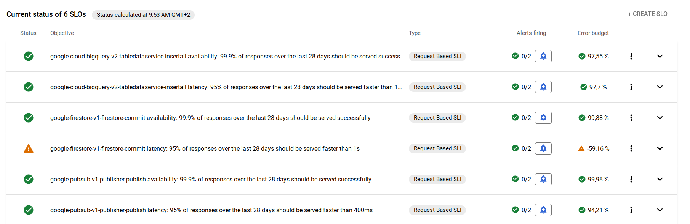

# terraform-google-transparent-slos

***Use Cloud Monitoring / Service monitoring to compare Google transparent SLIs against achievable SLOs and send alerts when the services under perform***

Google publishes [transparent SLIs](https://cloud.google.com/blog/products/gcp/transparent-slis-see-google-cloud-the-way-your-application-experiences-it)

You can leverage this data to set SLOs using Cloud Monitoring and be alerted when the specific Google APIs you consume in a specific project (or group of project aka metric scope) is not performing as usual.

So that, in case of an outage of your service, it will speed up triage to understand from where comes the issue: you service vs the Google APIs you depends on. Example:



## Pre-requisites

To use theses terraform modules, you will need a GCP project with:  

- APIs enabled
  - Cloud Monitoring API `monitoring.googleapis.com` (default)
  - Cloud Pub/Sub API `pubsub.googleapis.com`

- IAM roles for the service account used to run Terraform:
  - Project IAM Admin `roles/resourcemanager.projectIamAdmin`
  - Pub/sub Admin `roles/pubsub.admin`
  - Monitoring Admin `roles/monitoring.admin`

- Provision a GCS bucket to manage Terraform state.
- Install Terraform and google provider consistent with version specifyied in `versions.tf`

## Example

### main.tf

Uncomment and adapt

- bucket
- prefix
- version

### create a `terraform.tfvars` file like

```terraform
project_id = "<your-project-id>"

api_availability = {
  pubsub_publish = {
    rolling_period_days                = 28
    service                            = "pubsub.googleapis.com"
    method                             = "google.pubsub.v1.Publisher.Publish"
    goal                               = 0.999
    alerting_fast_burn_loopback_period = "1h"
    alerting_fast_burn_threshold       = 10
    alerting_slow_burn_loopback_period = "24h"
    alerting_slow_burn_threshold       = 2
  },
}

api_latency = {
  pubsub_publish = {
    rolling_period_days                = 28
    service                            = "pubsub.googleapis.com"
    method                             = "google.pubsub.v1.Publisher.Publish"
    goal                               = 0.95
    threshold_str                      = "400ms"
    threshold_value                    = 0.4
    alerting_fast_burn_loopback_period = "1h"
    alerting_fast_burn_threshold       = 10
    alerting_slow_burn_loopback_period = "24h"
    alerting_slow_burn_threshold       = 2
  },
}
```

## Use the dashboard to find which APIs you consume most, aka main dependencies

Cloud Console / Monitoring / Consumed API - Request count SUM over the last 28 days

Sort the colum `Lastest Value` by decreasing order so that most consumed APIs apprear top of list. Example:


## Adapt your `terraform.tfvars` file to set SLOs on your most consumed Google APIs

For the top3 example above it would be:

```terraform
api_availability = {
  pubsub_publish = {
    rolling_period_days                = 28
    service                            = "pubsub.googleapis.com"
    method                             = "google.pubsub.v1.Publisher.Publish"
    goal                               = 0.999
    alerting_fast_burn_loopback_period = "1h"
    alerting_fast_burn_threshold       = 10
    alerting_slow_burn_loopback_period = "24h"
    alerting_slow_burn_threshold       = 2
  },
  bigquery_insertall = {
    rolling_period_days                = 28
    service                            = "bigquery.googleapis.com"
    method                             = "google.cloud.bigquery.v2.TableDataService.InsertAll"
    goal                               = 0.999
    alerting_fast_burn_loopback_period = "1h"
    alerting_fast_burn_threshold       = 10
    alerting_slow_burn_loopback_period = "24h"
    alerting_slow_burn_threshold       = 2
  },
  firestore_commit = {
    rolling_period_days                = 28
    service                            = "firestore.googleapis.com"
    method                             = "google.firestore.v1.Firestore.Commit"
    goal                               = 0.999
    alerting_fast_burn_loopback_period = "1h"
    alerting_fast_burn_threshold       = 10
    alerting_slow_burn_loopback_period = "24h"
    alerting_slow_burn_threshold       = 2
  },
}

api_latency = {
  pubsub_publish = {
    rolling_period_days                = 28
    service                            = "pubsub.googleapis.com"
    method                             = "google.pubsub.v1.Publisher.Publish"
    goal                               = 0.95
    threshold_str                      = "400ms"
    threshold_value                    = 0.4
    alerting_fast_burn_loopback_period = "1h"
    alerting_fast_burn_threshold       = 10
    alerting_slow_burn_loopback_period = "24h"
    alerting_slow_burn_threshold       = 2
  },
  bigquery_insertall = {
    rolling_period_days                = 28
    service                            = "bigquery.googleapis.com"
    method                             = "google.cloud.bigquery.v2.TableDataService.InsertAll"
    goal                               = 0.95
    threshold_str                      = "150ms"
    threshold_value                    = 0.15
    alerting_fast_burn_loopback_period = "1h"
    alerting_fast_burn_threshold       = 10
    alerting_slow_burn_loopback_period = "24h"
    alerting_slow_burn_threshold       = 2
  },
  firestore_commit = {
    rolling_period_days                = 28
    service                            = "firestore.googleapis.com"
    method                             = "google.firestore.v1.Firestore.Commit"
    goal                               = 0.95
    threshold_str                      = "1s"
    threshold_value                    = 1
    alerting_fast_burn_loopback_period = "1h"
    alerting_fast_burn_threshold       = 10
    alerting_slow_burn_loopback_period = "24h"
    alerting_slow_burn_threshold       = 2
  },
}
```

***Observe the result on the last 28 days and set SLOs goals adapted to your context as an acheivable objective. Adapt also the burnrate threshlod to you context to avoid false positive and still be usefull.***

## Adapt the monitoring channel to receive alerts

By default the module create a pubsub topic to received the exessive error budget burn rate alerts. You can use the variable `notification_channels` to add the [notification channels](https://cloud.google.com/monitoring/support/notification-options) of you choice.

## To work with metric scopes

For each project to be added in the metric scope, add to your main.tf a terraform resource [google_monitoring_monitored_project](https://registry.terraform.io/providers/hashicorp/google/latest/docs/resources/monitoring_monitored_project)

example

```terraform
resource "google_monitoring_monitored_project" "thispj" {
  metrics_scope = "locations/global/metricsScopes/${var.project_id}"
  name          = "locations/global/metricsScopes/${var.project_id}/projects/tjispj-project-id"
}
```

When using `metric_scopes` monitored resources from all GCP monitored projects part of the scope appears in the GCP project hosting that `metric_scopes`.

You may want to deploy this module both at the `metric_scopes` hosting project level and in each of the monitored projects, so that it provides both an aggregated view in the `metric_scopes` (e.g. for BQ availability) and a break down view by monitored projects (e.g. for BQ latency that may depends on the SQL code).

Then, the `metric_scopes` hosting project will be the single place where to see all SLOs on Google APIs nicely grouped under a different service name in including the project ID, and it is possible the use the pre-populated label `project_id` to identify the scopes.

To make this event easier you can leverage this module the variable `service_display_name` to additional customization in the `terraform.tfvars` file. Example:

```terraform
service_display_name = "Dependency on Google APIs - aggregated"
```

Then, the `metric_scopes` hosting project will be the single place where to see all SLOs on Google APIs nicely grouped under a different service name for each project.
